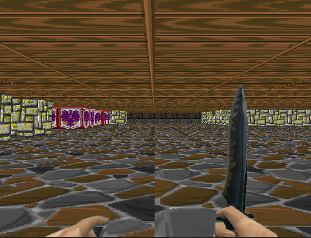

# 3D Raycasting Maze Game

## Overview
This project is a 3D game developed using raycasting, a technique that simulates 3D environments by casting rays from the player’s viewpoint. The game focuses on providing an immersive experience with simple mechanics, optimized performance, and a straightforward approach to rendering 3D environments in real-time.

Screenshot of the main gameplay interface.

## Running the Game
### On Windows
Run the following command in your terminal to compile the game and create the executable file:
./run.bat

### On Linux :
Run the following command on your terminal :
make

Once the game is compiled, you can run the executable (`maze.exe` or `./maze`) to start the game.
    
    

